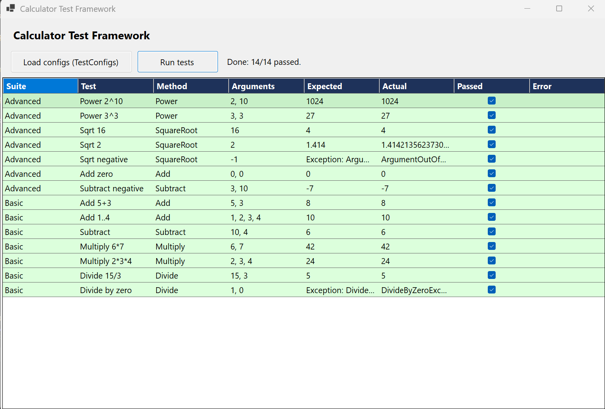

# Calculator Test Framework

Windows Forms app that runs tests on a `Calculator` class based on JSON config files.

## Features

- Load test configs from JSON (e.g. `TestConfigs/` folder)
- Run tests and show results in a grid (Suite, Test, Method, Arguments, Expected, Actual, Passed)
- Support for expected exceptions (e.g. Divide by zero, Sqrt of negative)

## How to run

1. Open the solution in Visual Studio or run from folder:
   ```bash
   dotnet run
   ```
2. Click **Load configs (TestConfigs)** then **Run tests**.

## Screenshot



## Structure

- `Configs/` – test suite and test case config models
- `Models/` – test result model
- `Services/` – config loading (`ITestConfigService` / `TestConfigService`)
- `TestConfigs/` – JSON files with test definitions
- `Calculator.cs` – class under test
- `TestRunner.cs` – runs tests and compares results
